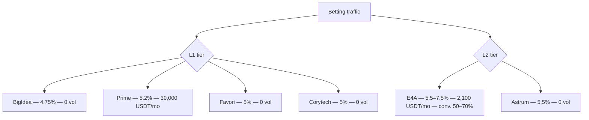
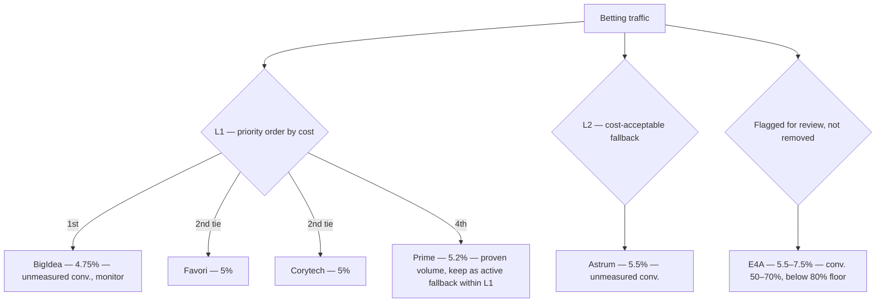
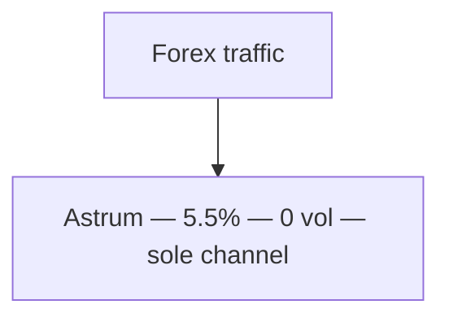
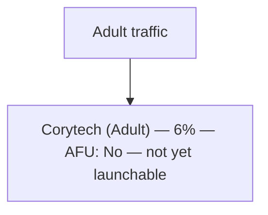
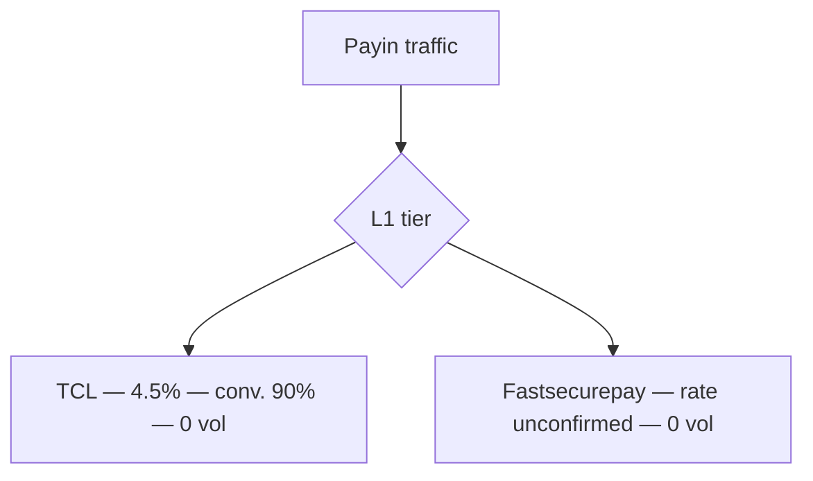
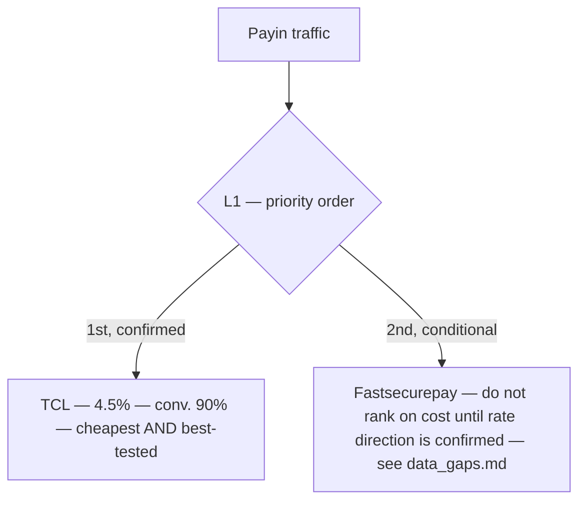
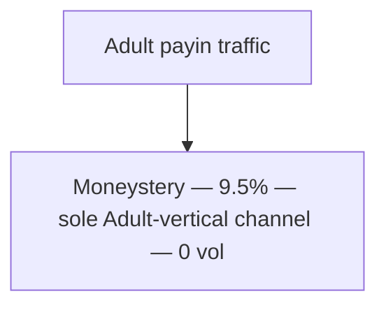
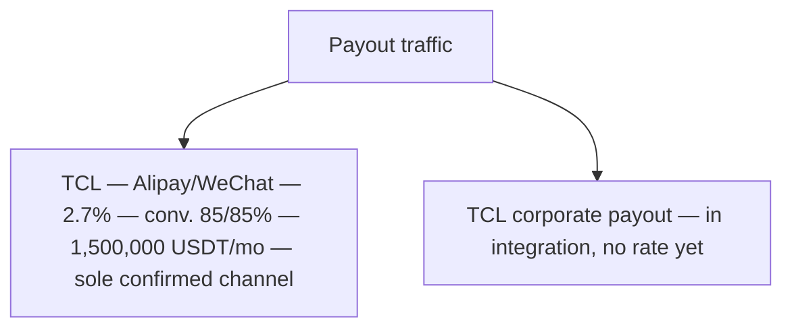
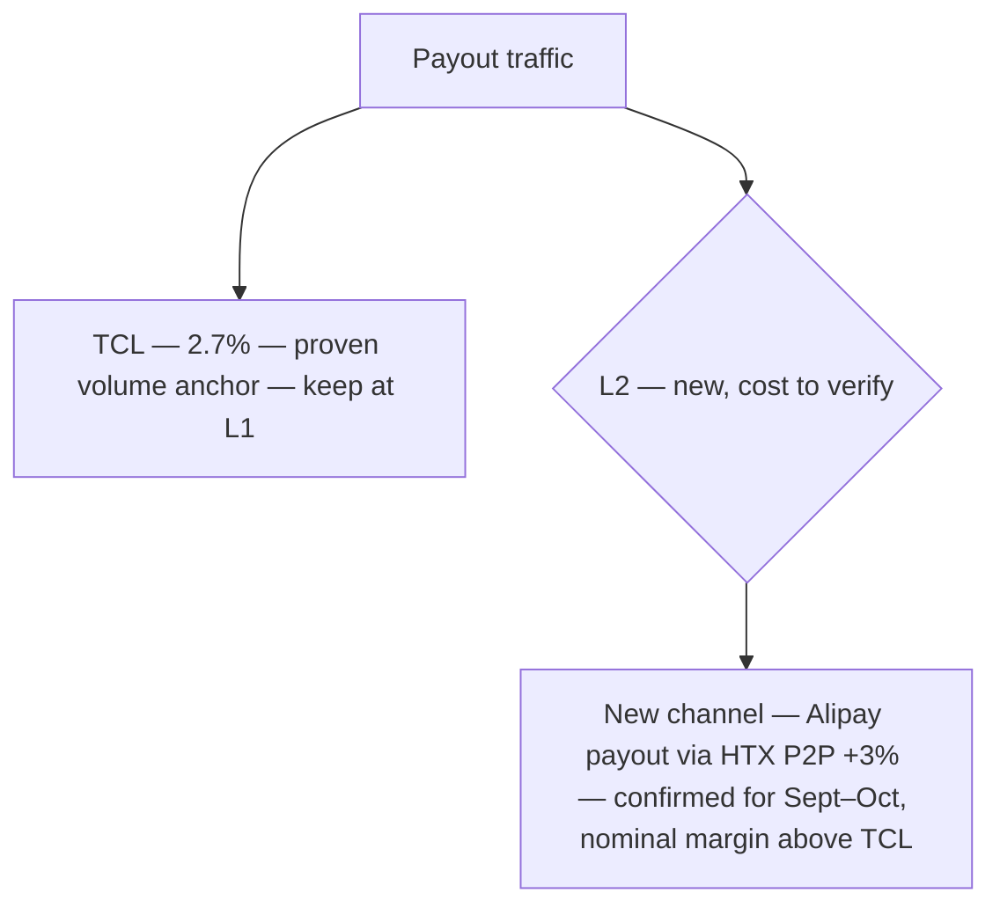

# Payment Cascades — Turkey & China

This is the core document in the pack. A cascade defines the order channels are tried in for a given GEO/vertical: **L1** lines take traffic first, **L2** lines are the fallback tier. Today's cascade lines (as tagged in the channel tracker) are **not cost-ordered** — several ties and one clear mispriced case sit inside the current L1 tier. This document shows the cascade as tracked today, then proposes a rebuild ordered by cost, with a conversion-rate check wherever that data actually exists.

## Methodology for the proposed cascades

1. **Sort by PayIn cost, ascending**, within each vertical's pool of Live/AFU-approved channels.
2. **Apply an 80% conversion floor only where conversion data is on file.** A channel below 80% is flagged for review regardless of how cheap it is — cost alone doesn't justify first position if it's failing to convert. A channel with *no* conversion data isn't penalized (there's nothing to measure yet) — it's flagged "unmeasured, monitor once live."
3. **Never reorder a channel that isn't Live/AFU-approved.** In-integration and not-yet-enabled lines stay out of the active cascade until they clear that bar — they appear here as pipeline, not as ranked options.
4. Every proposed change is justified against a real number from `docs/turkey_channel_review.md` / `docs/china_channel_review.md` — nothing here is reordered on judgment alone.

---

## Turkey — Betting

### Current cascade (as tracked)

**Problem with this as-is:** four channels share L1 with no cost priority between them, and the one actually carrying volume (Prime, 5.2%) is not the cheapest of the four (BigIdea, 4.75%). E4A sits in L2 at a higher cost *and* the only measured conversion rate in Turkey below an acceptable floor (50–70%).

### Proposed cascade (cost + conversion ordered)

**Rationale:**
- BigIdea moves to first priority: cheapest Live/AFU channel, currently getting zero traffic for no cost or status reason on file.
- Favori and Corytech tie on cost (5%) and both have zero traffic today — worth splitting test volume between them rather than picking one blind.
- Prime keeps a place in L1 (it's proven, not broken) but drops from *only* carrier of volume to *one of four*, ending the over-concentration described in `docs/cost_analysis.md`.
- E4A is moved out of a clean L2 fallback slot into an explicit **review** flag: it's simultaneously the second-most expensive line and the only one with a conversion problem on file. This isn't a recommendation to drop it — it's a recommendation to investigate before it keeps its L2 slot by default.
- Astrum stays L2 — acceptable cost, no data suggesting a problem, just unmeasured.

---

## Turkey — Forex

**Note:** Forex has exactly one channel on file (Astrum) and no traffic launched yet. There is no cascade to optimise here — the finding is structural: **single-channel dependency, no fallback tier exists.** Worth a line item once Forex traffic actually starts.

---

## Turkey — Adult

**Note:** Not a cascade yet — this is a launch-readiness item, not a reorder item. Corytech-Adult needs to clear AFU before it has a cascade position at all.

---

## China — General Payin (Low/mid-risk + Betting + Forex)

### Current cascade

### Proposed cascade

**Rationale:** TCL is the clear priority the moment payin traffic launches — it's both cheaper and the only one with conversion data. Fastsecurepay keeps its slot but shouldn't be treated as cost-competitive with TCL until its actual payin rate is confirmed (see `docs/data_gaps.md`) — ranking it today would be ranking on a number that may not even be the right metric.

---

## China — Adult Payin

**Note:** Single-channel, no alternative on file for this vertical — the 9.5% rate is the cost of accessing Adult in China at all, not a routing inefficiency. No reorder possible; worth sourcing a second Adult-capable channel if volume here grows.

---

## China — Payout

### Current cascade

### Proposed cascade — Sept–Oct addition

**Rationale:** TCL stays the L1 anchor — it's proven, stable, and there is no confirmed cheaper live alternative (see `docs/cost_analysis.md` on the Fastsecurepay direction mismatch). The new HTX channel is placed at **L2**, not co-L1, because its nominal +3% margin is higher than TCL's 2.7% — treat it as capacity/redundancy until the live HTX P2P quote is checked against TCL's xe.com reference. Promote it to L1 only if that check shows it's genuinely cheaper in practice, not just on the nominal margin.

---

## Summary of changes proposed in this document

| GEO | Vertical | Change | Why |
|---|---|---|---|
| Turkey | Betting | Promote BigIdea to top L1 priority | Cheapest Live/AFU channel, currently idle |
| Turkey | Betting | Split L1 priority across BigIdea/Favori/Corytech ahead of Prime | Ends over-concentration on one costlier channel |
| Turkey | Betting | Flag E4A for review rather than default L2 | Only channel with a known conversion problem (50–70%) |
| Turkey | Forex / Adult | No reorder — structural flags only | Single-channel dependency (Forex); not yet launchable (Adult) |
| China | Payin | Rank TCL first once traffic launches | Cheapest and only channel with conversion data |
| China | Payin | Don't cost-rank Fastsecurepay yet | Rate direction unconfirmed |
| China | Payout | Add HTX channel at L2, not L1 | Nominal cost is higher than TCL; needs live-quote verification |
