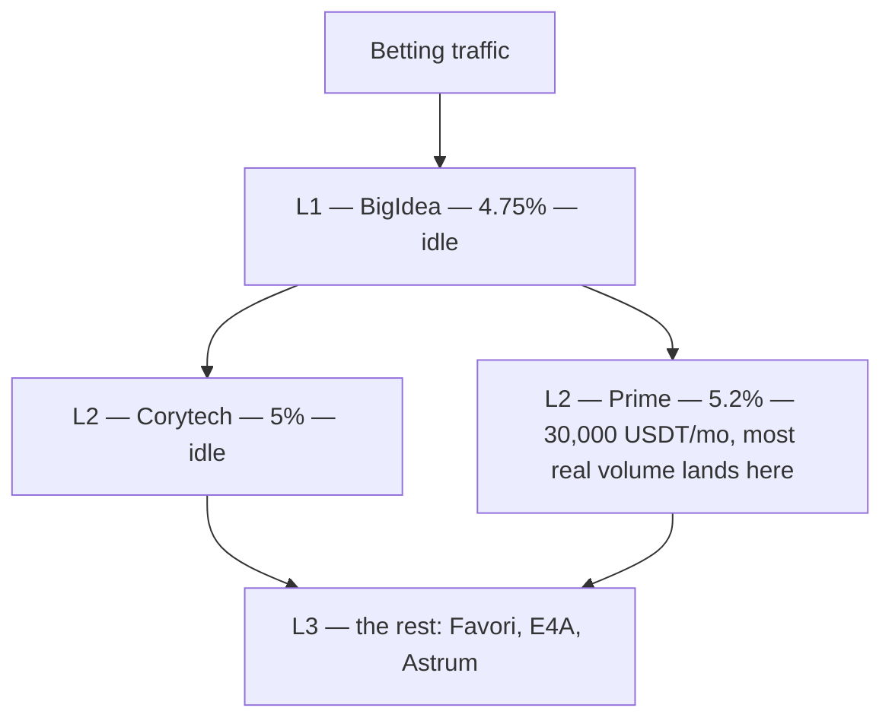
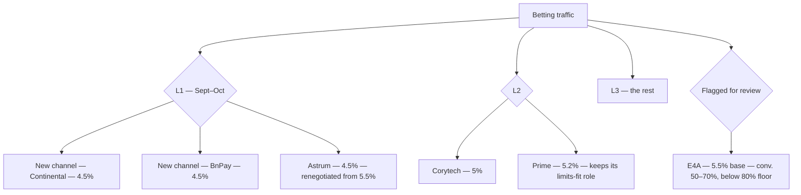
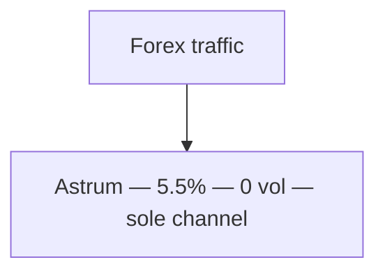
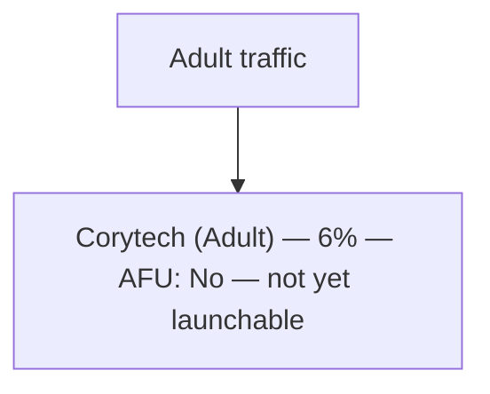
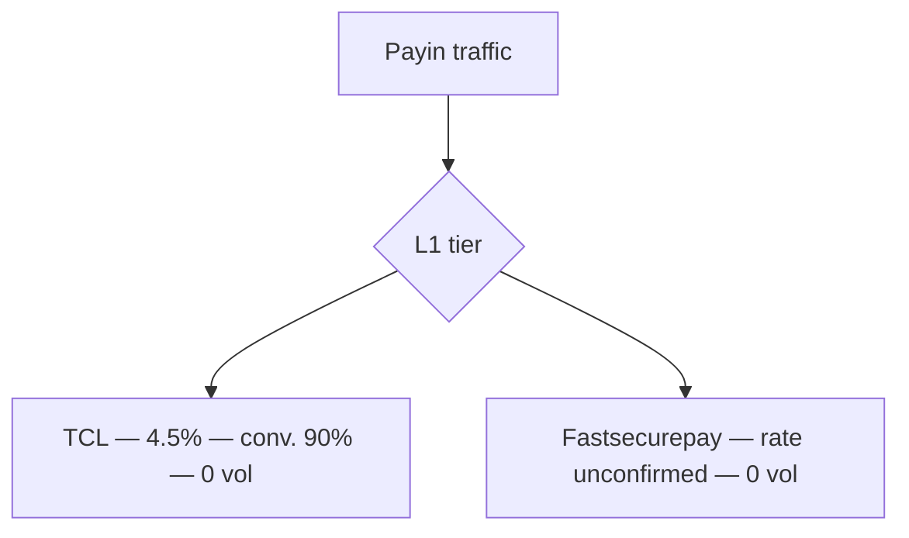
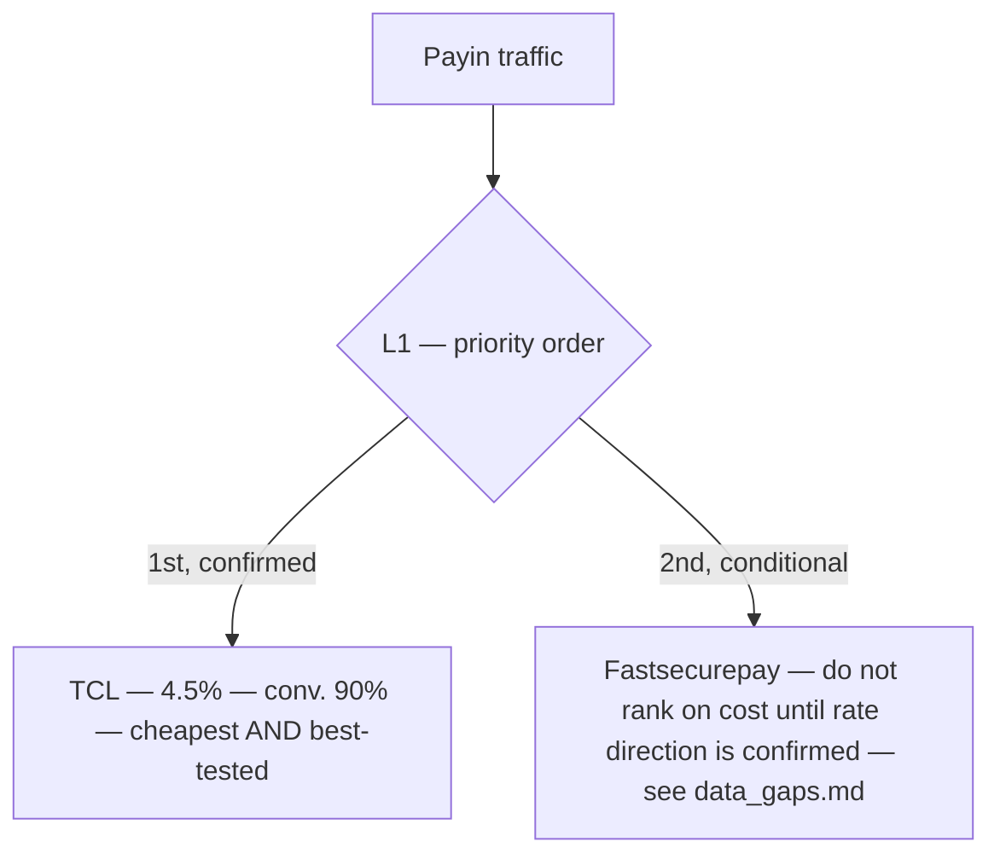
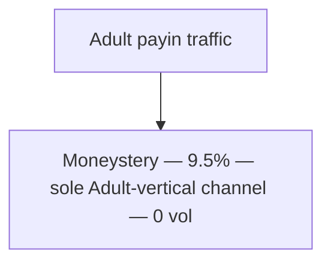
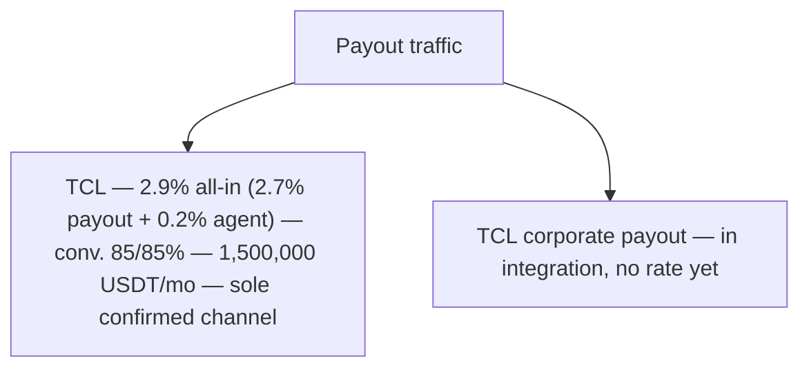
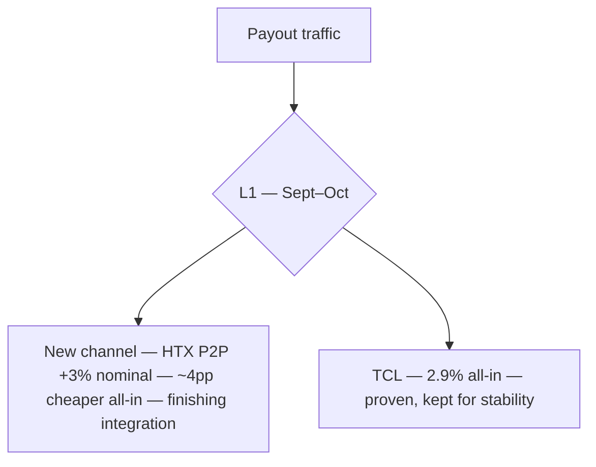

# Payment Cascades — Turkey & China

This is the core document in the pack. A cascade defines the order channels are tried in for a given GEO/vertical: **L1** lines take traffic first, fallback tiers pick up what L1 doesn't clear. This document shows each cascade as actually operated in August, then the confirmed or proposed rebuild for September–October — cost-ordered, with a conversion-rate check wherever that data exists, and with limits/traffic-fit called out explicitly where cost alone would be misleading (Turkey Betting).

## Methodology for the proposed cascades

1. **Sort by PayIn cost, ascending**, within each vertical's pool of Live/AFU-approved channels.
2. **Apply an 80% conversion floor only where conversion data is on file.** A channel below 80% is flagged for review regardless of how cheap it is — cost alone doesn't justify first position if it's failing to convert. A channel with *no* conversion data isn't penalized (there's nothing to measure yet) — it's flagged "unmeasured, monitor once live."
3. **Never reorder a channel that isn't Live/AFU-approved.** In-integration and not-yet-enabled lines stay out of the active cascade until they clear that bar — they appear here as pipeline, not as ranked options.
4. Every proposed change is justified against a real number from `docs/turkey_channel_review.md` / `docs/china_channel_review.md` — nothing here is reordered on judgment alone.

---

## Turkey — Betting

### Current cascade (August, as actually operated)

This supersedes the tracker's raw L1/L2 tags — confirmed by the payments team as how the cascade is actually run:

**Why Prime carries the volume despite sitting at L2, not L1:** Prime's settlement limits are lower and more stable than BigIdea's or any other live channel's, and Turkey's traffic is small-ticket by design — that traffic prioritises low, stable limits over the lowest headline rate. This is a deliberate fit, not routing inefficiency. See `docs/cost_analysis.md`.

**Still worth flagging:** E4A sits in L3 at a higher cost *and* the only measured conversion rate in Turkey below an acceptable floor (50–70%) — kept as a review item below regardless of the limits point above.

### Proposed cascade — September–October (desired)

Two new channels (Continental, BnPay) and a renegotiated Astrum rate (5.5% → 4.5%) combine into a strong, low-cost L1 tier:

**Rationale:**
- Continental and BnPay enter directly at L1 at 4.5% — both confirmed for Sept–Oct, both cheaper than everything in the current L1/L2 tiers.
- Astrum's renegotiated rate (4.5%) moves it from L3 into L1, alongside the two new channels — three low-cost, stable-limit channels now lead the cascade.
- Corytech and Prime move to L2: Prime keeps a strong position given its limits fit the traffic, but no longer needs to be the primary volume carrier once L1 is genuinely cheap and stable.
- E4A stays flagged for review, unchanged from August — cost and conversion concerns are independent of the L1 rebuild.

**Finding:** a strong L1 for September–October — low rates paired with stable, low limits — ahead of everything currently in the August cascade.

---

## Turkey — Forex

**Note:** Forex has exactly one channel on file (Astrum) and no traffic launched yet. There is no cascade to optimise here — the finding is structural: **single-channel dependency, no fallback tier exists.** Worth a line item once Forex traffic actually starts.

---

## Turkey — Adult

**Note:** Not a cascade yet — this is a launch-readiness item, not a reorder item. Corytech-Adult needs to clear AFU before it has a cascade position at all.

---

## China — General Payin (Low/mid-risk + Betting + Forex)

### Current cascade

### Proposed cascade

**Rationale:** TCL is the clear priority the moment payin traffic launches — it's both cheaper and the only one with conversion data. Fastsecurepay keeps its slot but shouldn't be treated as cost-competitive with TCL until its actual payin rate is confirmed (see `docs/data_gaps.md`) — ranking it today would be ranking on a number that may not even be the right metric.

---

## China — Adult Payin

**Note:** Single-channel, no alternative on file for this vertical — the 9.5% rate is the cost of accessing Adult in China at all, not a routing inefficiency. No reorder possible; worth sourcing a second Adult-capable channel if volume here grows.

---

## China — Payout

### Current cascade (August)

### Proposed cascade — September–October (confirmed)

**Rationale:** TCL's nominal margin (2.7%) and the new channel's (~3%) look similar, but the new channel's live HTX P2P USDT→CNY rate runs more favourably than TCL's xe.com reference — per the payments team, the true all-in cost is roughly **4 percentage points lower**. Both channels sit at L1: the new channel absorbs the cost-sensitive share of volume, TCL stays for its proven track record and stability while the new channel finishes integration. This is a confirmed change, not a scenario to verify — see `docs/data_gaps.md` for the provenance of the 4pp figure.

**Tied growth targets (by end of October, as provided):** payout volume 1,500,000 → 3,000,000 USDT/month; blended margin 0.1% → 4–5%. See `docs/china_channel_review.md`.

---

## Summary of changes proposed in this document

| GEO | Vertical | Change | Why |
|---|---|---|---|
| Turkey | Betting | Corrected current cascade to L1: BigIdea / L2: Corytech, Prime / L3: the rest | Reflects how the cascade is actually operated, per the payments team, not the tracker's raw tags |
| Turkey | Betting | Sept–Oct: add Continental + BnPay (4.5%) to L1, renegotiate Astrum to 4.5% and move it to L1 | Builds a genuinely low-cost, stable-limit L1 tier |
| Turkey | Betting | Keep E4A flagged for review | Only channel with a known conversion problem (50–70%), unchanged by the L1 rebuild |
| Turkey | Forex / Adult | No reorder — structural flags only | Single-channel dependency (Forex); not yet launchable (Adult) |
| China | Payin | Rank TCL first once traffic launches | Cheapest and only channel with conversion data |
| China | Payin | Don't cost-rank Fastsecurepay yet | Rate direction unconfirmed |
| China | Payout | Sept–Oct: add HTX channel at L1 alongside TCL | Confirmed ~4pp cheaper all-in once live FX is accounted for, per the payments team |
